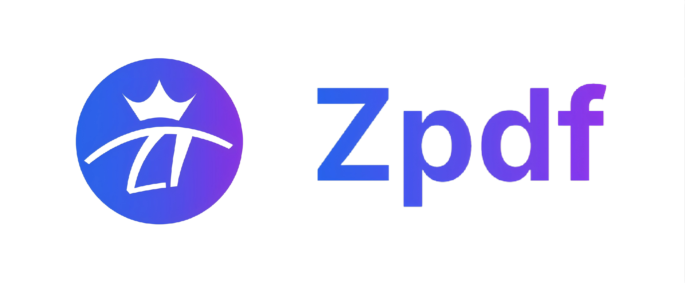

<!-- Zpdf logo -->

  

# Zpdf Official Website

 🚀<a href="https://www.zhiyipdf.com/">Direct access to Zpdf Official Website (zhiyipdf.com) → ✨No installation required (online version) 📱Full-featured client ⚡One-click call for developer API, zero deployment threshold, multi-form coverage for all scenarios, try now!</a>

[English](README.md) | [Simplified Chinese](README_CN.md)

# Zpdf
## Product Introduction
Zpdf is a PDF document processing platform based on **fine-tuned large language models**, which features professional-level parsing and processing capabilities for special document types such as **complex PDF layouts**, **LaTeX mathematical formulas**, **chemical molecular formulas**, **image tables**, and **watermarked PDFs**. It is suitable for various scenarios including **research**, **education**, and **office work**.

The tool revolves around 4 core functions to provide users with a full-process PDF processing solution:

**1. High-precision PDF to Markdown Parsing and Translation**
- Accurately identify and extract text, formulas, tables and other content from PDFs, and convert them into editable Markdown format with one click to meet the input requirements of large models, while supporting multilingual translation.

  

**2. Handwritten Image/PDF Recognition**
- Achieve high-accuracy recognition and digital extraction of non-printed or blurred text content such as handwritten text, handwritten formulas, and handwritten chemical molecular formulas, effectively solving the pain point that handwritten materials are difficult to edit and retrieve.

  

**3. Multi-format Bidirectional Conversion (Markdown-centric)**
- Support flexible conversion of Markdown files into commonly used office formats such as Word and PDF, as well as professional typesetting formats such as HTML and TeX, adapting to document output requirements in different scenarios.

  

**4. Accurate PDF Translation with Original Layout Retained**
- Different from traditional PDF translation, Zpdf strictly replicates the layout structure of the original document during the translation process, making it suitable for professional documents such as academic papers and technical manuals.

  

## Changelog
- **Zpdf-v1.2 Released on 2025/12/03**

  **Updates to PDF Translation with Original Layout Retained:**
  - Integrated a new model to solve the problem of untranslated partial LaTex formulas in the old version.
  - Directly provide a two-column comparison output format, eliminating the need to switch back and forth between the original text and the translated text.
  - Further optimized the retention of original format and translation output for PPT-type PDFs, improved the output adaptive function, and reduced output noise.
  
  **Updates to PDF Parsing:**
  - Further optimized the parsing robustness for blurred documents and documents with complex layout formats.
  
  **Other Updates:**
  - Resolved the repeated download issue caused by network environment.
  - Fixed other known issues.

- **Zpdf-v1.0.1 Released on 2025/11/17**
  - Integrated a **new model** into the **PDF Parsing** function, comprehensively improving recognition accuracy and significantly increasing translation efficiency.
  - Integrated a **new model** into the **Handwritten Image Recognition** function, comprehensively improving recognition accuracy.
  - Fully upgraded the web version interface for a clearer and more intuitive visual and operational experience.
  - Fully support **recognition, parsing, and translation** of Chinese, English, Japanese, Korean, French, German, Spanish, and Russian.
  - Integrated the historical **file management system**, with processed files retained for **7** days.
  - Integrated the **user management system**, supporting one-click login for users.
  - Fixed some known issues.

  
Historical Versions

  

    
Zpdf-v0.2.2 Released on 2025/10/01

    <ul><li>
      - Added the **Translation with Original Layout Retained** function.
      - Fixed some known issues.
    </li></ul>
  

  
  

    
Zpdf-v0.2.2 Released on 2025/10/01

    <ul><li>
      Added the **Translation with Original Layout Retained** function.
      Fixed some known issues.
    </li></ul>
  

  

    
Zpdf-v0.2.1 Released on 2025/09/15

    <ul><li>
      - Added format conversion function.
      - Fully revised the interface for a clearer and more intuitive visual and operational experience.
      - Added several new functions.
      - Fixed some known issues.
    </li></ul>
  

  

    
Zpdf-v0.1.3 Released on 2025/08/01

    <ul><li>
      - Added several new functions.
      - Fixed some known issues.
    </li></ul>
  

  

    
Zpdf-v0.1.2 Released on 2025/07/21

    <ul><li>
      - Added the **Handwritten Image Recognition** function.
      - Fixed some known issues.
    </li></ul>
  

  

    
Zpdf-v0.1.1 Released on 2025/06/10

    <ul><li>
      - Integrated a new model into the PDF parsing function.
      - Introduced Deepseek v3 and Chat GPT-5 interfaces.
      - Fully revised the interface.
      - Fixed some known issues.
    </li></ul>
  

  

    
Zpdf-v0.0.4 Released on 2025/04/21

    <ul><li>
      - Added several new functions.
    </li></ul>
  

  

    
Zpdf-v0.0.3 Released on 2025/01/01

    <ul><li>
      - Fixed some known issues.
    </li></ul>
  

  

    
Zpdf-v0.0.2 Released on 2024/08/13

    <ul><li>
      - Fixed some known issues.
    </li></ul>
  

  

    
Zpdf-v0.0.1 Released on 2022/10/06

    <ul><li>
      - Created the platform prototype, integrated **PDF-Markdown parsing** and translation functions.
      - Conducted **large model fine-tuning** based on the university's **professional corpus**.
    </li></ul>
  

